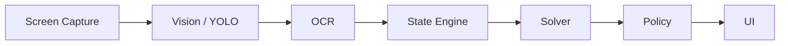
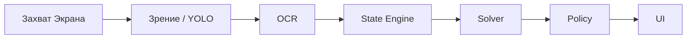

# ♠️ Poker Helper — Real-Time External Poker Assistant

<p align="center">
  
  
  
</p>

[🇺🇸 English Version](#english) | [🇷🇺 Русская версия](#русский)

---

<a id="english"></a>
## 🇺🇸 English Version

> Production-grade external poker assistant using screen capture, computer vision, OCR, and deterministic poker logic.

### ⚠️ Ethical Use

This tool is **fully external** — it does NOT:
- Read process memory
- Inject into game processes
- Hook internal APIs
- Automate clicks or gameplay actions
- Implement stealth or anti-detection

It ONLY uses screen capture, computer vision, OCR, and deterministic poker math, displayed in a separate helper UI window.

### 🏗 Architecture

The system follows a sequential pipeline where each module communicates via typed Pydantic schemas. All confidence scores are treated as first-class citizens across all layers.



### 🚀 Quick Start

**Prerequisites:** Python 3.11+

```bash
# Clone the repository
git clone <repository_url>
cd poker-helper

# Install dependencies
pip install -r requirements.txt
# Install development dependencies (optional)
pip install -r requirements-dev.txt

# Run the API server
make api  # or: uvicorn apps.api.main:app --reload --host 0.0.0.0 --port 8000

# Run the UI (dev mode)
make ui   # or: python -m http.server 3000 --directory apps/ui

# Run tests
make test # or: pytest tests/ -v
```

### 🐳 Docker

To run the application using Docker:

```bash
make docker # or: docker-compose up --build
```

### 📁 Project Structure

| Directory | Purpose |
|-----------|---------|
| `libs/common/` | Shared Pydantic schemas |
| `services/capture_agent/` | Screen/window capture |
| `services/vision_core/` | YOLO card/element detection |
| `services/ocr_core/` | OCR text extraction |
| `services/state_engine/` | Temporal fusion → canonical state |
| `services/solver_core/` | Equity, Monte Carlo, pot odds |
| `services/policy_layer/` | Action recommendation engine |
| `services/explainer/` | Human-readable explanations |
| `apps/api/` | FastAPI backend |
| `apps/ui/` | Helper UI overlay |
| `data/` | Frames, labels, synthetic data |
| `tests/` | Unit & integration tests |
| `evals/` | Evaluation framework |
| `infra/` | Docker, nginx configs |

### 🛠 Make Commands

We provide a `Makefile` with the following useful commands:

- `make install` - Install main dependencies
- `make dev` - Install dev dependencies
- `make test` - Run tests
- `make lint` - Run ruff linter
- `make typecheck` - Run mypy static type checking
- `make api` - Run API server
- `make ui` - Run UI server
- `make docker` - Build and run docker containers
- `make clean` - Clean cache files

### 🔌 API Endpoints

| Endpoint | Method | Description |
|----------|--------|-------------|
| `/health` | GET | Health check |
| `/api/v1/analyze-frame` | POST | Analyze single frame |
| `/api/v1/analyze-sequence` | POST | Analyze frame sequence |

### 📄 License

Private — for personal use only.

---

<a id="русский"></a>
## 🇷🇺 Русская версия

> Полноценный внешний помощник для покера, использующий захват экрана, компьютерное зрение, OCR и детерминированную покерную логику.

### ⚠️ Этичное использование

Этот инструмент **полностью внешний** — он НЕ:
- Читает память процессов
- Внедряется в игровые процессы
- Перехватывает внутренние API
- Автоматизирует клики или игровые действия
- Использует скрытность или анти-обнаружение

Он ТОЛЬКО использует захват экрана, компьютерное зрение, OCR и детерминированную покерную математику, отображая результаты в отдельном окне пользовательского интерфейса.

### 🏗 Архитектура

Система использует последовательный конвейер (пайплайн), в котором каждый модуль обменивается данными через типизированные Pydantic схемы. Оценки уверенности (confidence scores) являются приоритетными данными на всех уровнях.



### 🚀 Быстрый старт

**Требования:** Python 3.11+

```bash
# Клонирование репозитория
git clone <repository_url>
cd poker-helper

# Установка зависимостей
pip install -r requirements.txt
# Установка зависимостей для разработки (опционально)
pip install -r requirements-dev.txt

# Запуск API сервера
make api  # или: uvicorn apps.api.main:app --reload --host 0.0.0.0 --port 8000

# Запуск UI (режим разработки)
make ui   # или: python -m http.server 3000 --directory apps/ui

# Запуск тестов
make test # или: pytest tests/ -v
```

### 🐳 Docker

Для запуска приложения через Docker:

```bash
make docker # или: docker-compose up --build
```

### 📁 Структура проекта

| Директория | Назначение |
|------------|------------|
| `libs/common/` | Общие схемы Pydantic |
| `services/capture_agent/` | Захват экрана/окна |
| `services/vision_core/` | Обнаружение карт и элементов (YOLO) |
| `services/ocr_core/` | Распознавание текста (OCR) |
| `services/state_engine/` | Объединение данных → каноническое состояние |
| `services/solver_core/` | Эквити, Монте-Карло, шансы банка (pot odds) |
| `services/policy_layer/` | Движок рекомендаций действий |
| `services/explainer/` | Человекочитаемые объяснения |
| `apps/api/` | Бэкенд на FastAPI |
| `apps/ui/` | Оверлей помощника (UI) |
| `data/` | Кадры, разметки, синтетические данные |
| `tests/` | Модульные и интеграционные тесты |
| `evals/` | Фреймворк для оценки (бенчмарки) |
| `infra/` | Конфиги Docker и nginx |

### 🛠 Команды Make

В проекте есть `Makefile` с полезными командами:

- `make install` - Установить основные зависимости
- `make dev` - Установить зависимости для разработки
- `make test` - Запустить тесты
- `make lint` - Запустить линтер (ruff)
- `make typecheck` - Статическая проверка типов (mypy)
- `make api` - Запустить API сервер
- `make ui` - Запустить UI сервер
- `make docker` - Собрать и запустить Docker контейнеры
- `make clean` - Очистить файлы кэша

### 🔌 API Эндпоинты

| Эндпоинт | Метод | Описание |
|----------|-------|----------|
| `/health` | GET | Проверка состояния (Health check) |
| `/api/v1/analyze-frame` | POST | Анализ одного кадра |
| `/api/v1/analyze-sequence` | POST | Анализ последовательности кадров |

### 📄 Лицензия

Приватная — только для личного использования.
